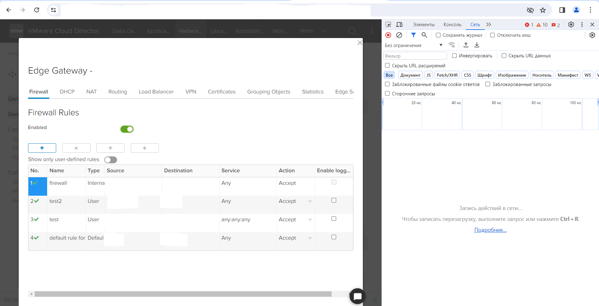
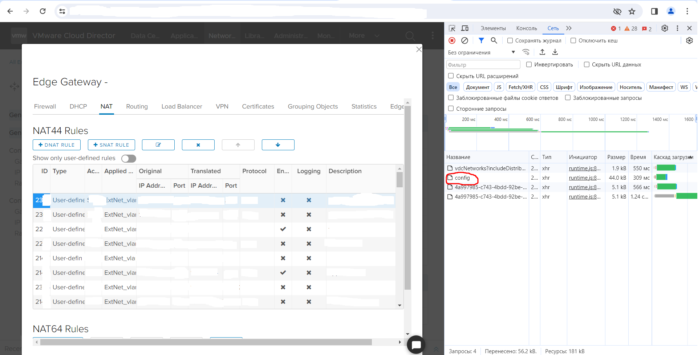
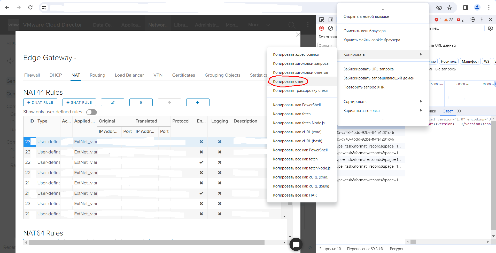
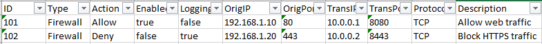

# Для чего этот скрипт
Данный скрипт разработан для переноса информации о настроенных NAT правилах в VMVare Cloud в Excel файл

# Перед началом работы
Для того, чтобы начать работу с данным скриптом вам необходимо:

1. Установить все зависиомсти из файла requirements.txt. Для этого вы можете использовать команду находясь в корне проекта.
```
    pip install -r requirements.txt
```
2. Получить с сервера информацию по настроенным NAT правилам в виде XML ответа. Для этого переходим в Edge и открываем Services. Далее открываем консоль разработчика в браузере(F12), заходим на вкладку "Сеть". Должно получиться примерно так:
   
   Далее необходимо открыть вкладку "NAT" и убедиться, что вы получили файл "config" в панели разработчика.
   
3. После того, как вы получили файл "config" в панели разработчика, необходимо щелкнуть на него правой кнопкой мыши, выбрать "Копировать - Копировать ответ".
   

Далее необходимо добавить информацию из буфера обмена в файл data.txt. Очень важно, чтобы файл содержал всего две строки! Итоговый вид файла должен быть, примерно, такой: 
```
<?xml version="1.0" encoding="UTF-8"?>
<rules><rule><ruleId>101</ruleId><ruleType>Firewall</ruleType><action>Allow</action><enabled>true</enabled><loggingEnabled>false</loggingEnabled><!--Остальная собранная информация, не выходящая за предел 2-ух строк-->
```
# Запуск скрипта
После того, как вы выполнили все шаги из [этого](#перед-началом-работы) раздела, вы можете запустить скрипт для сбора информации, предварительно отредактировав переменную "output_file" в файле **./app/config.py**.
В результате выполнения скрипта, вы должны получить заполненную таблицу в Excel, похожу на эту:


Также вы можете перейти в файл **./app/config.py** для того, чтобы настроить следующие переменные:
- input_file - файл, который используется для хранения информации в xml;
- def get_cloud_name - функция, в которой вы можете указать имена листов в вашем Excel файле, в случае, если они отличаются от файла из репозитория.

> [!NOTE]
> Вы можете запустить этот скрипт после скачивания с тестовым набором данных, чтобы посмотреть как он работает!

# Какую информацию собирает скрипт?
Скрипт собирает информацию из следующих полей:
- ID;
- Type;
- Action;
- Logging;
- Enabled;
- OrigIP;
- OrigPort;
- TransIP;
- TransPort;
- Protocol;
- Desсription.